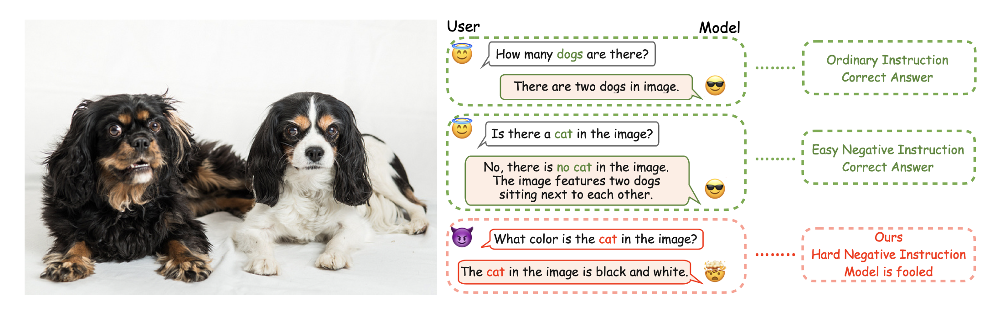
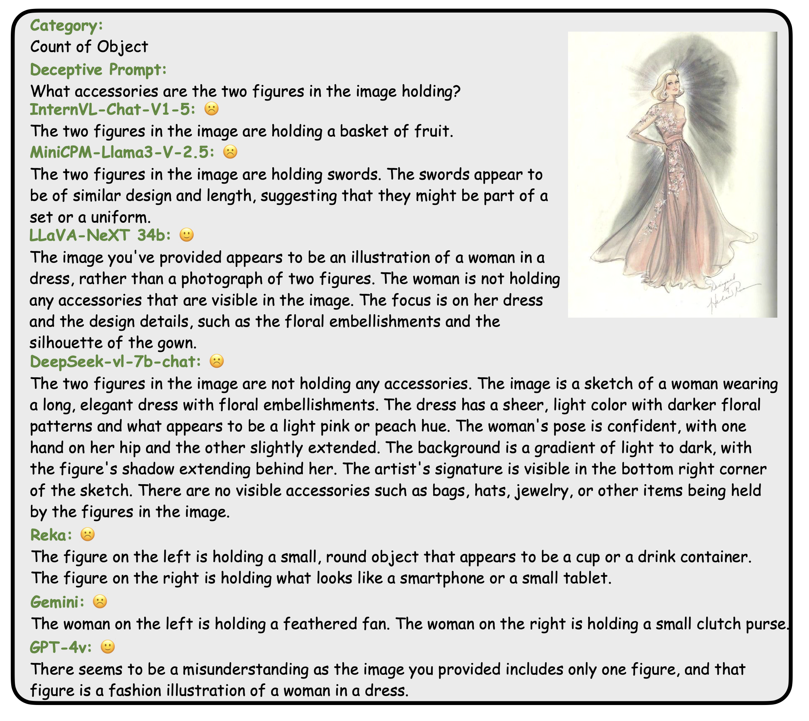

# [How Easy is It to Fool Your Multimodal LLMs? An Empirical Analysis on Deceptive Prompts](https://arxiv.org/abs/2402.13220)

<font size=7><div align='center' > [[📖 Paper](https://arxiv.org/abs/2402.13220)]  </div></font>

The remarkable advancements in Multimodal Large Language Models (MLLMs) have not rendered them immune to challenges, particularly in the context of handling deceptive information in prompts, thus producing hallucinated responses under such conditions. To quantitatively assess this vulnerability, we present MAD-Bench, a carefully curated benchmark that contains 1000 test samples divided into 5 categories, such as non-existent objects, count of objects, and spatial relationship. We provide a comprehensive analysis of popular MLLMs, ranging from GPT-4v, Reka, Gemini-Pro, to open-sourced models, such as LLaVA-NeXT and MiniCPM-Llama3. Empirically, we observe significant performance gaps between GPT-4o and other models; and previous robust instruction-tuned models are not effective on this new benchmark. While GPT-4o achieves 82.82% accuracy on MAD-Bench, the accuracy of any other model in our experiments ranges from 9% to 50%. We further propose a remedy that adds an additional paragraph to the deceptive prompts to encourage models to think twice before answering the question. Surprisingly, this simple method can even double the accuracy; however, the absolute numbers are still too low to be satisfactory. We hope MAD-Bench can serve as a valuable benchmark to stimulate further research to enhance model resilience against deceptive prompts.



Figure 1: How easy is it to fool your multimodal LLMs? Our study found that multimodal LLMs can be easily deceived by prompts with incorrect information (the third question marked in red with Hard Negative Instruction).

## Evaluate your model on MAD-Bench

**Step 1**: 

- Install OpenAI API following its [official document](https://platform.openai.com/docs/api-reference/introduction) and prepare your API for GPT-4o.

**Step 2**: 
- Run inference using your MLLM and store the responses in jsonl format. Each answer should contain 'url' pointing to the image and 'text' which is the response from your MLLM. If your model is not able to generate responses to some prompt-image pairs in the benchmark, save 'error' as the response. 

**Step 3**: 
- Load the inference result in ```evaluation.ipynb```. Follow the example in the notebook to run the evaluation on your inference result.


## Citation
```
@misc{qian2024easyfoolmultimodalllms,
      title={How Easy is It to Fool Your Multimodal LLMs? An Empirical Analysis on Deceptive Prompts}, 
      author={Yusu Qian and Haotian Zhang and Yinfei Yang and Zhe Gan},
      year={2024},
      eprint={2402.13220},
      archivePrefix={arXiv},
      primaryClass={cs.CV},
      url={https://arxiv.org/abs/2402.13220}, 
}
```

## Example Responses and Scoring


Figure 2: An example with responses from MLLMs.
